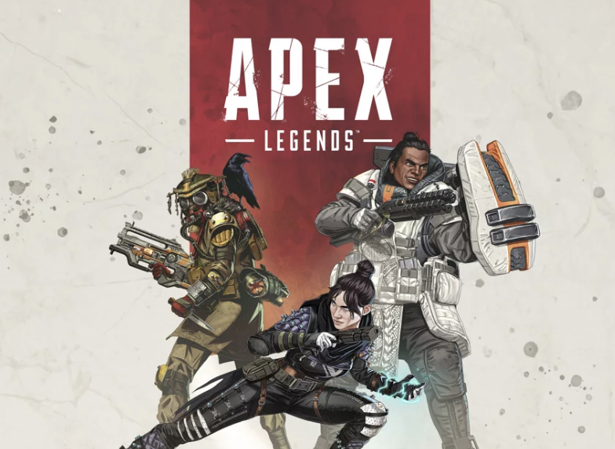
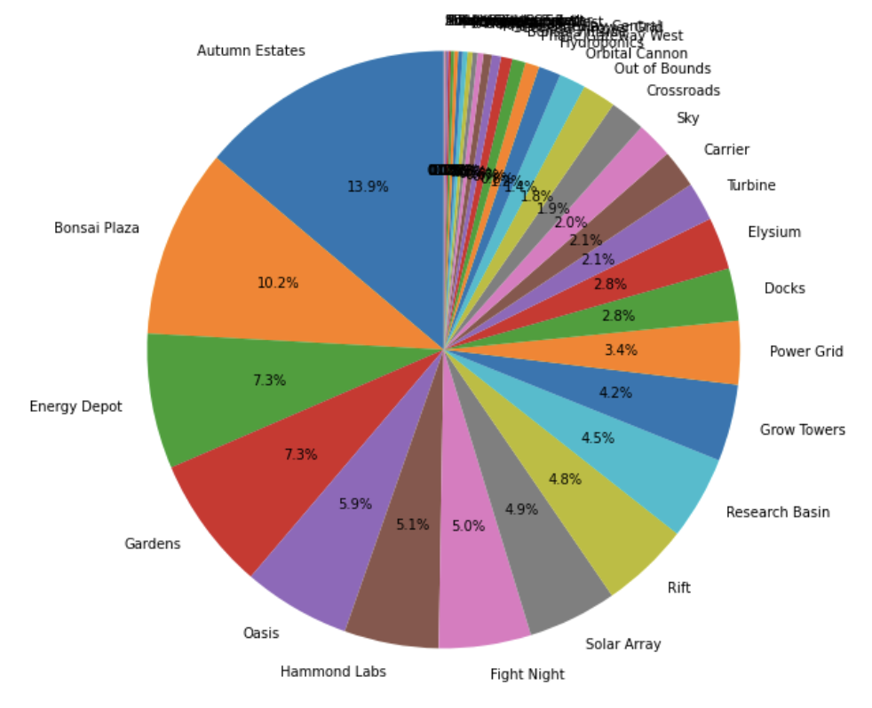
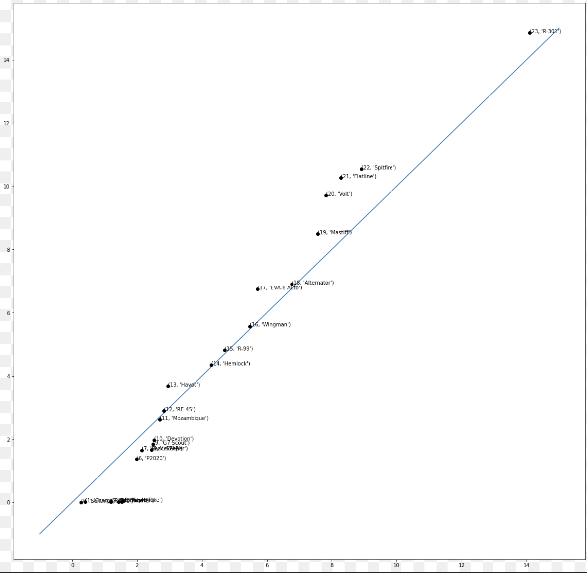
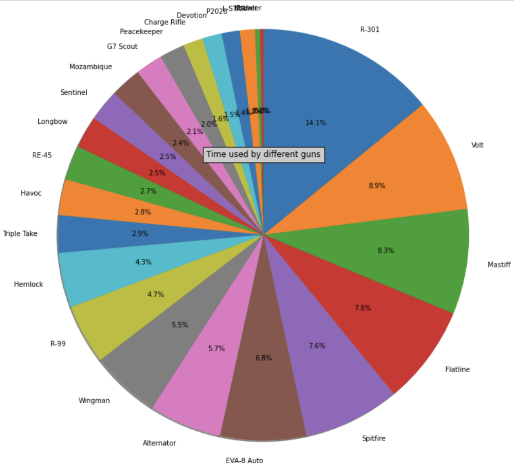
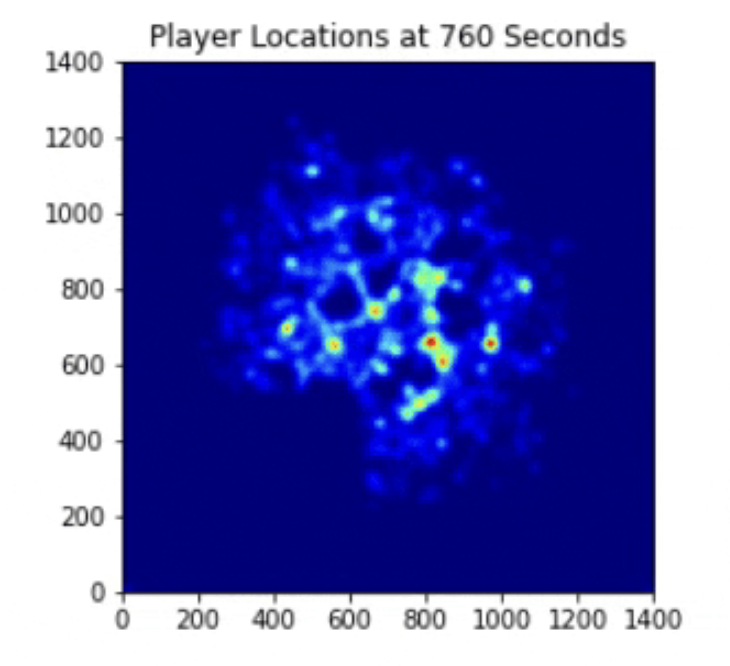

## Apex Legends Data Analysis
This project was done in a 4 person team during the UCLA Advanced Computer Science Summer Institute.
In this project, we created a multitude of graphs to analyze optimal strategy trends in the video game Apex Legends using Google Colab. 
This included a deep learning model that calculated a player’s game success based on specific key factors.

  

Apex Legends is an online multiplayer battle royale game featuring squads of three players using pre-made characters with distinctive abilities, called "Legends". 
The winner is the last team standing as surrounding zones close around them.
One of the goals of our project was to find how players move throughout the map. This means looking at how players loot, and how they move across areas. 
This also means looking at where the most congested areas of the map are. 
Another goal of the project was to find which weapons are overrated or underrated.  

Below are a few of our graphs:  

